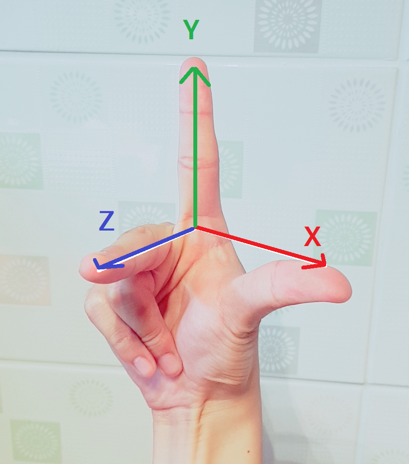
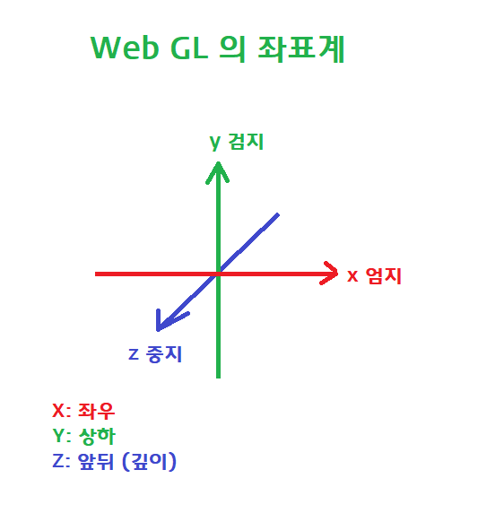
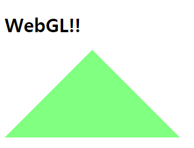

# WebGL 정리

**1). 좌표계**

**오른손** 좌표계를 사용한다.





**2). 렌더링 파이프라인**

크게 다음과 같은데. 

|  1   |       2       |    3     |         4         |   5    |
| :--: | :-----------: | :------: | :---------------: | :----: |
|  점  | 버텍스 쉐이더 | 레스터화 | 프레그먼트 쉐이더 | 렌더링 |


각 요소를 자세히 살펴보면

|        단계         | 역할                                                         |
| :-----------------: | :----------------------------------------------------------- |
|  **Vertex Shader**  | 공간상에 점들을 배치하는 역할                                |
|   **Rasterizer**    | Vertex Shader 가 배치한 점들을 Fragment Shader 가 처리할 수 있는 데이터로 변환(=Rasterization 레스터화) |
| **Fragment Shader** | 레스터화된 데이터들을 가지고 픽셀값 계산(색깔)               |
|    **Rendering**    | 계산된 픽셀들(2차원 행렬-화면은 2차원 평면)을 화면에 뿌려줌  |


버텍스 쉐이더는 점들의 위치를 배치하는 역할을 하고

이 계산 된 점들을 모아 vertices 데이터로 반환한다.

그리고 이 점들을 화면상의 픽셀에 뿌려지기 위한 변환을 거치는데.

이 과정을 Rasterization(레스터화) 이라고 한다. 

레스터화가 되면 이제 Fragment Shader 가 이를 받아서 화면상에 픽셀로 찍어준다.


**3). 실습**

아래와 같이 삼각형을 그리는 opengl 프로그램을 만들어보자.




간단하게, html 파일에 gl프로그램이 들어갈 **canvas 태그**를 선언한 다음,

```html
<canvas></canvas>
```

나머지는 소스코드 참조!